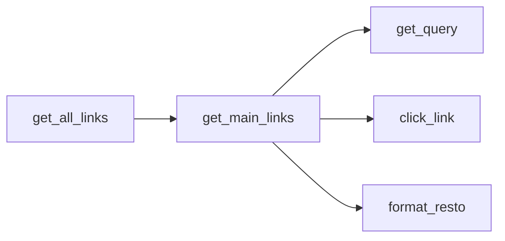
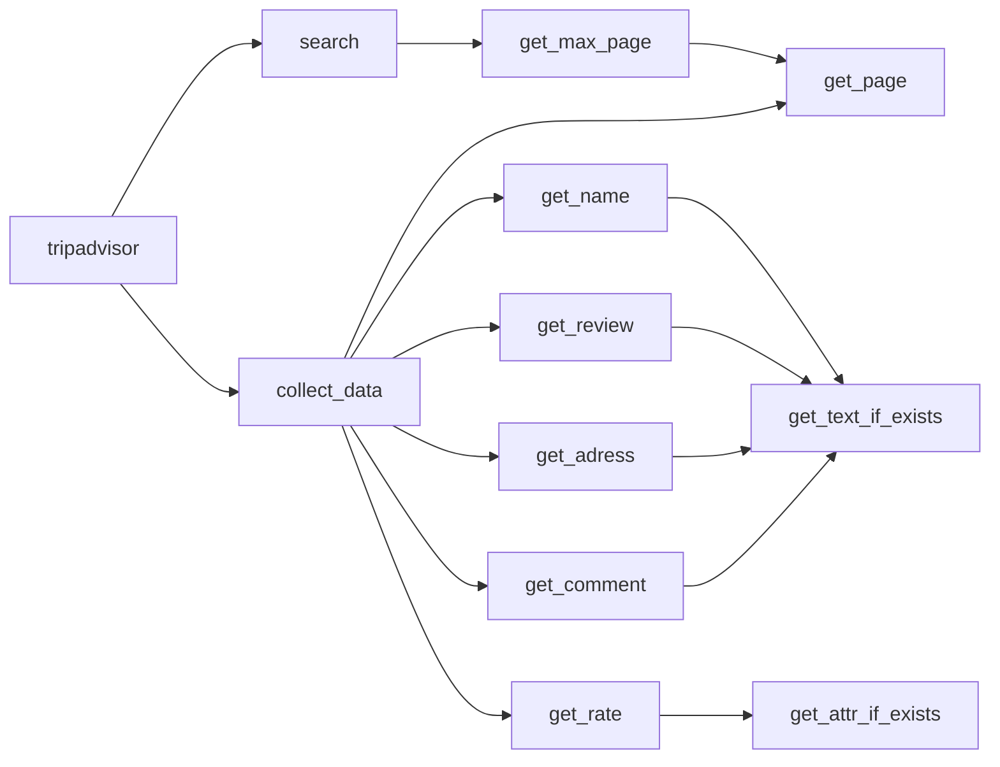

# tripad_python
> **Goal**: To create a specific web scraper for trip advisor. We want to collect data about trip advisor recommendation for restaurants, hotels, trip advices and vacation rentals. We want to collect the name, the number of comment, the comments themselves, the rating, the rank and the localization of each recommendation.

## Plan
**Architecture of the functions project**

**Current work**

> Will soon be merged with the old code (see bellow)

We have a certain amount of page and entities for each type of data

- Hotel: 48 pages / 1439 entities
- Attractions: 34 pages / 1007 entities 
- Tours: 16 pages / 470 entities
- Rental: 40 pages / 2000 entities
- Restaurant: 60 pages / 1792 entities

Time:

- Without comments: ~10h30
- With comments: 12 days and ~12h

**Old code (still working)**

> This code didn't help getting the information in the location of palermo. The new one correct the problem. It is constructed separatly right now (see up)

## Current situation

The code is running (take at most 3 minutes) and collect the following informations:

1. Name
2. Rating
3. Number of Review
4. Address
5. Number of comment

**Issues**: 

- The scraper collect information from place regardless of the geographic situation (it simply searches all the place in the world with the name we give at the beginning)
- The final csv file is not clean, especially for addresses which are sometimes unusable

Steps:

- [x] Refactoring the old code
  - [x] Create a map of the functions
  - [x] Group functions into specific modules
  - [x] Test the new modules on the new pages
  - [x] Bring the useful one to the new folder
- [x] Create a scrapper starter
  - [x] See if it is possible to create a general quering one
    - [x] If yes, start the querying task
    - [x] Create a time estimator
  - [x] Create a new map for the functions
  - [ ] Information to scrap
    - [ ] Name
    - [ ] Type
    - [ ] Description
    - [ ] Rank
    - [ ] Rating
    - [ ] Number of reviews / comment
    - [ ] Address
    - [ ] Geo-tag
    - [ ] Picture?
  - [ ] Start with
    - [x] Trip advices
    - [ ] Tours
    - [ ] Hotels
    - [ ] Vacation rentals
    - [ ] **New**: Restaurant
  - [x] Add a timer to see how long it would take
  - [ ] Do some test with limited figure or small places
- [ ] Add features to collect comments
  - [ ] Create the first test
  - [ ] Estimate the time it would take for the whole project
- [x] Try feature to collect data from restaurant
  - [x] Try to grab the API if it exist
  - [x] Else try to automate mouse move/clic and scrolling
  - [x] Estimate the time it would take
